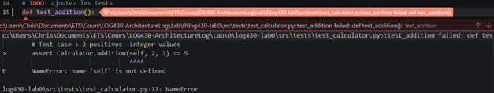
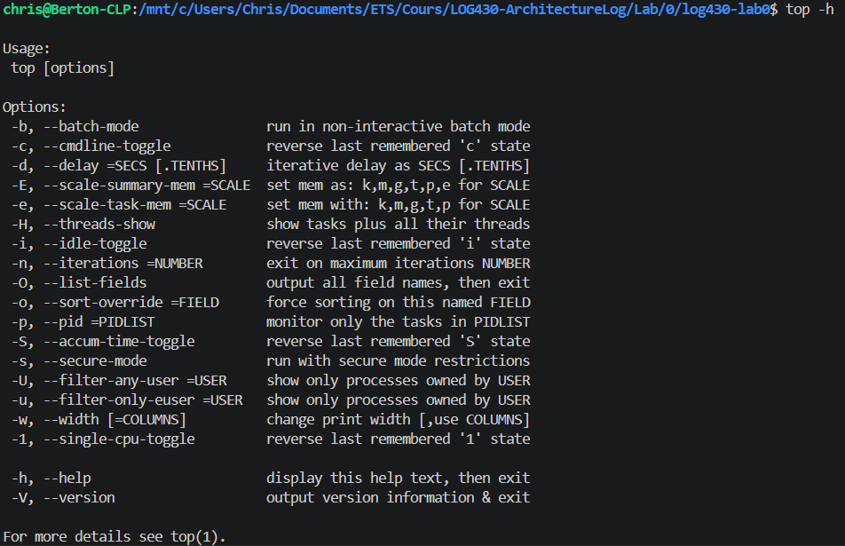

# Exemple de soumission d'activité
ÉTS - LOG430 - Architecture logicielle - Hiver/Printemps/Été/Automne 202X

Étudiant(e) : Chris-Emmanuel Berton

# Questions
(Il est obligatoire d'ajouter du code, des captures d'écran ou des sorties de terminal pour illustrer chacune de vos réponses.)

## 1. XXXXX
Pytest indique, à la ligne où se situe l’erreur, la source de celle-ci.

## 2. XXXXXXXXX
Ces étapes connectent configurent l'environnement à travailler avec GitHub.

## 3. XXXXXXXXX
La commande top permet de monitorer 

## N. XXXXXXXXX
Réponse

# Déploiement
(Le cas échéant, décrivez votre pipeline CI/CD et ce que vous avez appris dans ce laboratoire en ce qui concerne le déploiement. Il est obligatoire d'ajouter du code, des captures d'écran ou des sorties de terminal pour illustrer votre réponse.)